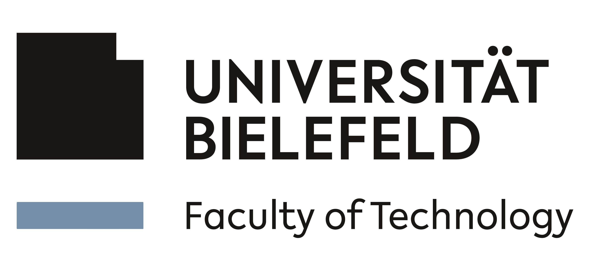
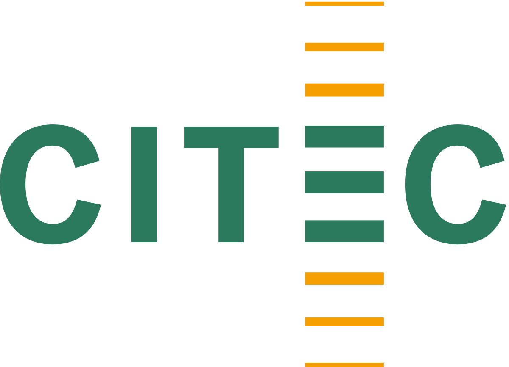

    &nbsp;&nbsp;&nbsp;&nbsp;&nbsp;&nbsp;
    &nbsp;&nbsp;&nbsp;&nbsp;
    &nbsp;&nbsp;&nbsp;&nbsp;
    

# Collaborative Robotics Group - Bielefeld University

Welcome to the GitHub page of the Collaborative Robotics Research Group led by [Prof. Dr. Klaus Neumann](https://ekvv.uni-bielefeld.de/pers_publ/publ/PersonDetail.jsp?personId=26109209).

Our research group is a joint initiative of [Bielefeld University](https://www.uni-bielefeld.de) and [Fraunhofer IOSB-INA](https://www.iosb-ina.fraunhofer.de) in Lemgo.

We are part of the [Cognitive Interaction Technology](https://www.uni-bielefeld.de/zwe/citec/) (CITEC) research center and the [Faculty of Technology](https://www.uni-bielefeld.de/fakultaeten/technische-fakultaet/) at Bielefeld University.

## About Us

The Collaborative Robotics research group focuses on the intuitive use of collaborative robotic systems in manipulation and assembly based on imitation learning. Our research focuses on:

- **Reconfigurable and modular robots**
- **Intelligent product transport**
- **Neural control and regulation of robots in safe interaction with human production participants**
- **Magnetic levitation systems and planar robotics**

Our goal is to develop innovative solutions for industrial automation and to optimize the collaboration between humans and machines.

    

## Research Projects and Publications

On this page, you will find links to our Git repositories mentioned in our scientific publications. These repositories contain code, datasets, and other resources generated as part of our research work.

## Contact

For more information, please visit our [official website](https://www.uni-bielefeld.de/fakultaeten/technische-fakultaet/forschung/ag-ueberblick/kollaborative-robotik/).

---

Thank you for your interest in our work!
