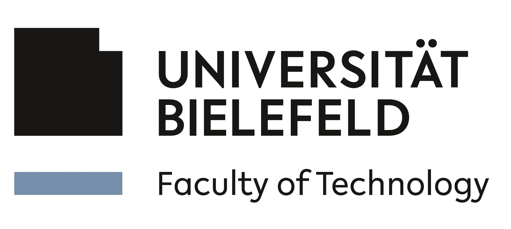
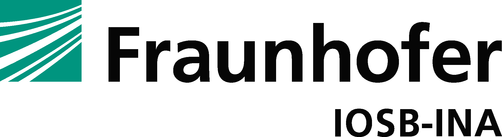

    &nbsp;&nbsp;&nbsp;&nbsp;&nbsp;&nbsp;
    &nbsp;&nbsp;&nbsp;&nbsp;
    &nbsp;&nbsp;&nbsp;&nbsp;
    

# AG Kollaborative Robotik - Universität Bielefeld

Willkommen auf der öffentlichen Seite der Arbeitsgruppe für Kollaborative Robotik unter der Leitung von [Prof. Dr. Klaus Neumann](https://ekvv.uni-bielefeld.de/pers_publ/publ/PersonDetail.jsp?personId=26109209).

Unsere Forschungsgruppe ist eine gemeinsame Initiative der [Universität Bielefeld](https://www.uni-bielefeld.de) und dem [Fraunhofer IOSB-INA](https://www.iosb-ina.fraunhofer.de) in Lemgo.

Wir sind Teil des Forschungszentrums [Cognitive Interaction Technology](https://www.uni-bielefeld.de/zwe/citec/) (CITEC) und der [Technischen Fakultät](https://www.uni-bielefeld.de/fakultaeten/technische-fakultaet/) der Universität Bielefeld.

## Über uns

Die AG Kollaborative Robotik beschäftigt sich mit dem intuitiven Einsatz kollaborativer Robotersysteme in der Manipulation und Montage auf Basis von Imitationslernen. Unsere Forschung konzentriert sich auf:

- **Rekonfigurierbare und modulare Roboter**
- **Intelligenter Produkttransport**
- **Neuronale Steuerung und Regelung von Robotern in sicherer Interaktion mit menschlichen Produktionsteilnehmern**
- **Systeme der magnetischen Levitation und Planarrobotik**

Unser Ziel ist es, innovative Lösungen für die industrielle Automation zu entwickeln und die Zusammenarbeit zwischen Mensch und Maschine zu optimieren.

    

## Forschungsprojekte und Veröffentlichungen

Auf dieser Seite finden Sie Links zu unseren Git-Repositories, die in unseren wissenschaftlichen Publikationen erwähnt werden. Diese Repositories enthalten Code, Datensätze und andere Ressourcen, die im Rahmen unserer Forschungsarbeiten entstanden sind.

## Kontakt

Für weitere Informationen besuchen Sie bitte unsere [offizielle Website](https://www.uni-bielefeld.de/fakultaeten/technische-fakultaet/forschung/ag-ueberblick/kollaborative-robotik/).

---

Vielen Dank für Ihr Interesse an unserer Arbeit!
